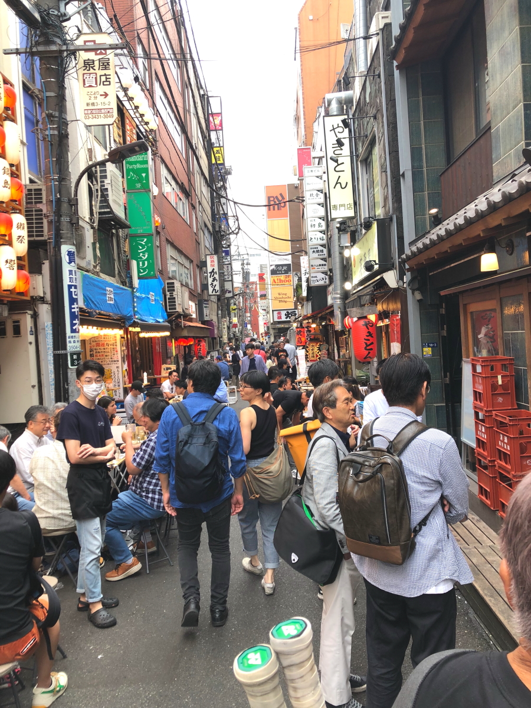
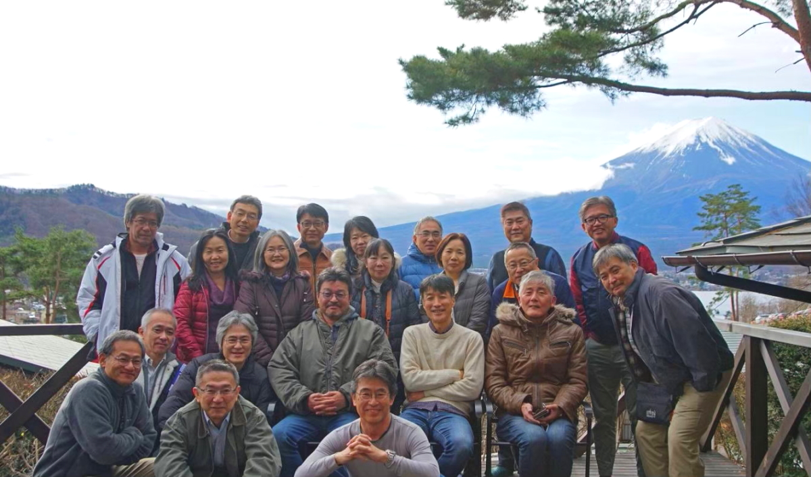

# Empty-s_3

<html lang="ja">
 <head>
  <meta charset="utf-8" />
 

<link href="https://cdnjs.cloudflare.com/ajax/libs/lightbox2/2.7.1/css/lightbox.css" rel="stylesheet">
   
</head>

  モバイル端末をお使いの場合は、画面を横向きにするとより見やすくご覧頂けます。

<body onload="alert('エンプティーズ と レプレッションズ、忘年会の記録です！')" onunload="alert('再会の時まで、元気でお過ごしくださいませ。またやりましょう〜(^o^)/')">
<h1><marquee behavior="alternate">!!! Empty's & Lepression's !!!</marquee></h1>

<a href="https://torokoid.github.io/Empty-s/">忘年会</a>><a href="https://torokoid.github.io/Empty-s_2/">忘年会_2</a>>6月新橋飲み会

2023、新橋、飲み会。

                              

 アクセス用QRコード

<marquee direction="right" scrollamount="20" width="30%">(^_^)/~hada</marquee>

	
	
<h2><marquee behavior="alternate">!!! 2023年6月10日、新橋で飲み会!!!</marquee></h2>
	
<h3>↓ 画像はクリックで拡大、スライドショー表示します。</h3>
<section><h4>2023年6月10日 今回は一郎に予約してもらいました。</h4></section> 

	  
お店は「魚金総本店」ですね！

<section><h4>以下、適当な写真集</h4></section>
 
	
飲屋街は通路にお客さんが溢れ出すほど盛況！

	  
一次会写真集！

	  
一次会全員写真！

	  
移動中、雨がSLに反応！

	  
栃木には無いQRコードトイレシステム！

	  
二次会写真集！、みきちゃん死角で写真撮れず〜誰か撮ってたら送って〜

	   
むっち〜提供の懐かし写真集！

                              

  

 

<!-- フッタ -->
 <footer>
 Copyright 2023/06/11 S.Hada
 </footer>
